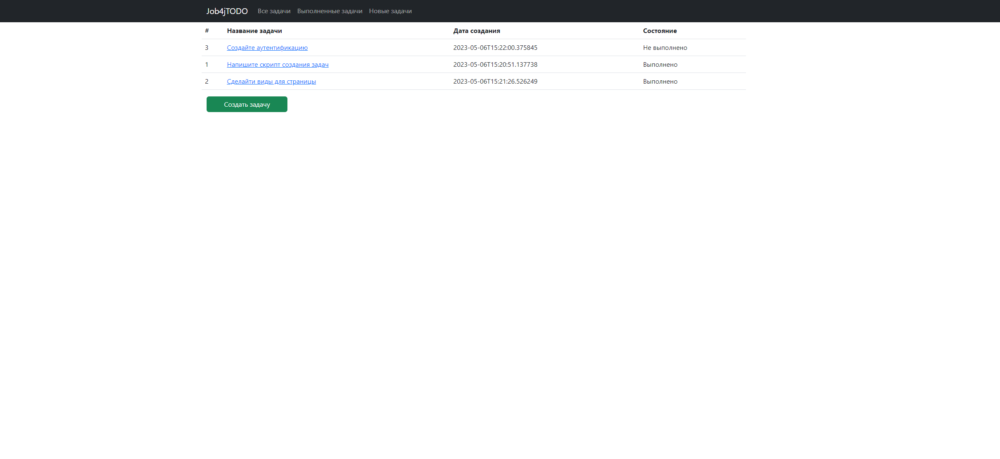
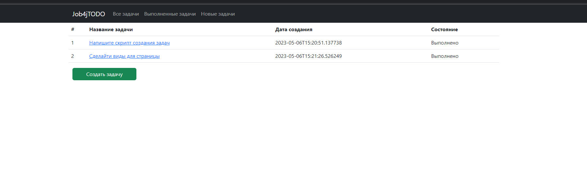
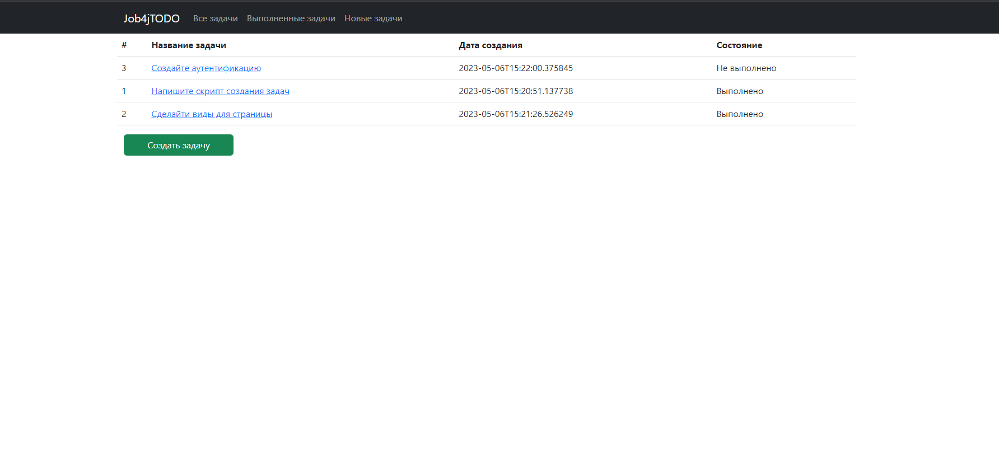
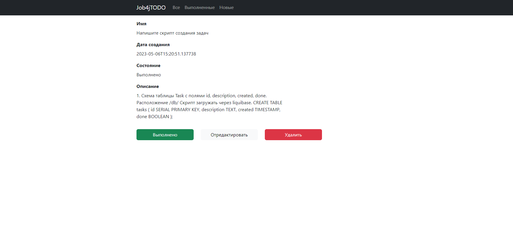
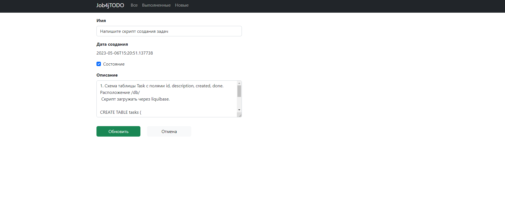
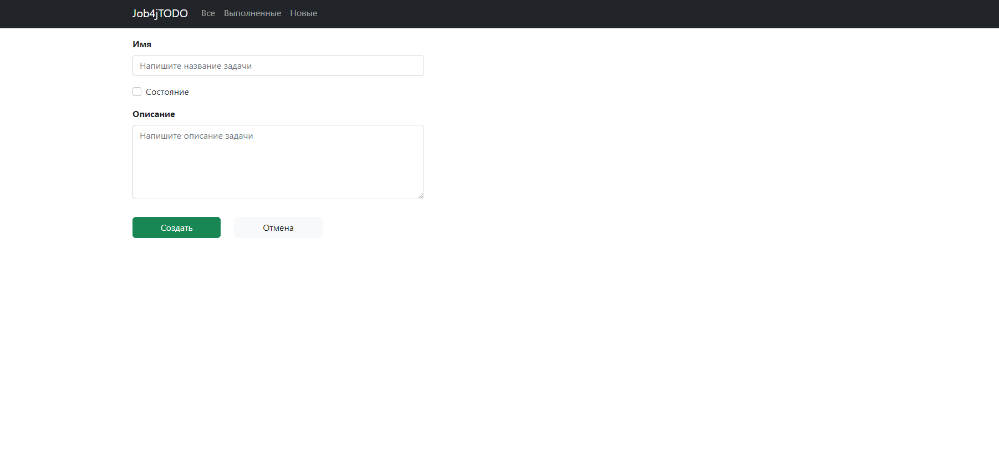

<h3 align="center">Project JOB4J_Todo</h3>

<!-- ABOUT THE PROJECT -->
## About The Project

Project Todo - is a web application which tracks task list.
Task has id, created date and time, description and complete status.
User can switch task status as completed or update whole task information.


## Technology stack
- Spring boot
- Thymeleaf
- Bootstrap
- Hibernate
- PostgreSql

## Environment requirements
- Java 17
- Maven 3.8
- PostgreSQL 14

## Getting started

- Create new database for project
```sql
create database todo
```
- Create new table tasks
```sql
CREATE TABLE tasks (
   id SERIAL PRIMARY KEY,
   description TEXT,
   created TIMESTAMP,
   done BOOLEAN
);
```
- Run the project
```
mvn spring-boot:run
```

## Interactions with application

- On main page you can see information about tasks.
  
- Completed tasks.
  
- New tasks shows only last 24h added
  
- User can open a task by clicking on it and see details
  
- Also by clicking edit button the update page opens
  
- Adding new task page
  
### Reference Documentation
For further reference, please consider the following sections:

* [Official Apache Maven documentation](https://maven.apache.org/guides/index.html)
* [Spring Boot Maven Plugin Reference Guide](https://docs.spring.io/spring-boot/docs/3.0.6/maven-plugin/reference/html/)
* [Create an OCI image](https://docs.spring.io/spring-boot/docs/3.0.6/maven-plugin/reference/html/#build-image)
* [Thymeleaf](https://docs.spring.io/spring-boot/docs/3.0.6/reference/htmlsingle/#web.servlet.spring-mvc.template-engines)
* [Spring Web](https://docs.spring.io/spring-boot/docs/3.0.6/reference/htmlsingle/#web)
* [Spring Data JPA](https://docs.spring.io/spring-boot/docs/3.0.6/reference/htmlsingle/#data.sql.jpa-and-spring-data)

### Guides
The following guides illustrate how to use some features concretely:

* [Handling Form Submission](https://spring.io/guides/gs/handling-form-submission/)
* [Building a RESTful Web Service](https://spring.io/guides/gs/rest-service/)
* [Serving Web Content with Spring MVC](https://spring.io/guides/gs/serving-web-content/)
* [Building REST services with Spring](https://spring.io/guides/tutorials/rest/)
* [Accessing Data with JPA](https://spring.io/guides/gs/accessing-data-jpa/)

## Контакты.
- skyrockpk@gmail.com
- <a href="https://t.me/julus_skyrock" target="_blank">Телеграм</a></h1>